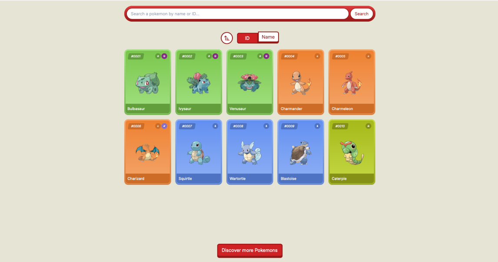
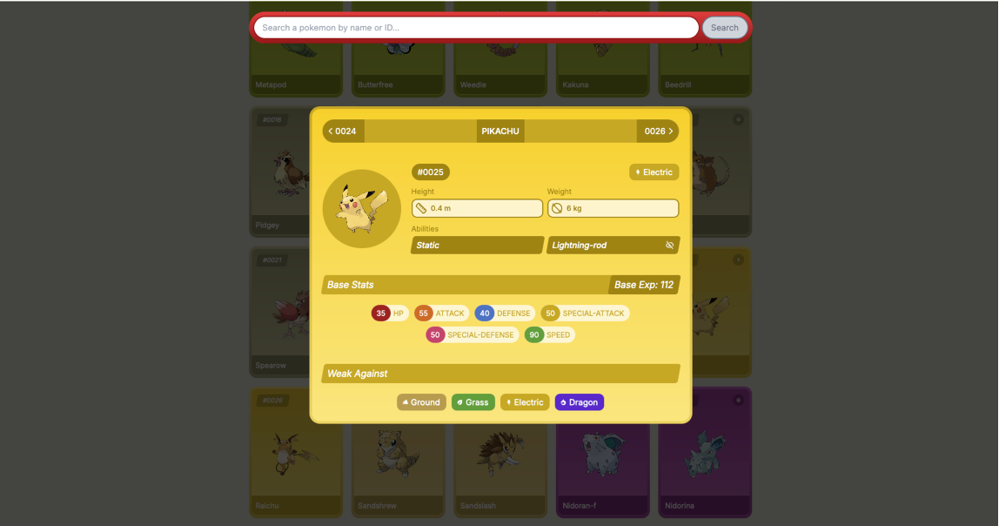

# Pokedex

A modern web application that allows users to browse and explore Pokemon data. Built with React, Redux, and the PokeAPI.

## Features

- Browse Pokemon with pagination with real-time data fetching from PokeAPI



- Sort Pokemon by name or ID and Toggle between ascending and descending sort order


- View pokemon details and navigate between Pokemon with next/previous controls



- Responsive design


## Tech Stack

- React
- Redux Toolkit for state management
- TypeScript for type safety
- pokedex-promise-v2 for Pokemon API integration

## Getting Started

### Prerequisites

- Node.js (v14 or higher)
- npm or yarn

### Installation

1. Clone the repository:
```bash
git clone https://github.com/ethanny/Pokedex.git
cd Pokedex
```

2. Install dependencies:
```bash
npm install
# or
yarn install
```

3. Start the development server:
```bash
npm run dev
# or
yarn dev
```

The application will be available at `http://localhost:5174`

## Project Structure

- `src/services/pokedex_slice.tsx` - Redux slice for managing Pokemon data and UI state
- `src/components/` - React components
- `src/pages/` - Page components
- `src/services/` - API and other services

## State Management

The application uses Redux Toolkit to manage the following state:

- Pokemon list and pagination
- Selected Pokemon
- Sort order and options

## Contributing

1. Fork the repository
2. Create your feature branch (`git checkout -b feature/AmazingFeature`)
3. Commit your changes (`git commit -m 'Add some AmazingFeature'`)
4. Push to the branch (`git push origin feature/AmazingFeature`)
5. Open a Pull Request

## License

This project is licensed under the MIT License - see the LICENSE file for details.

## Acknowledgments

- [PokeAPI](https://pokeapi.co/) for providing the Pokemon data
- [pokedex-promise-v2](https://github.com/PokeAPI/pokedex-promise-v2) for the Pokemon API client 
